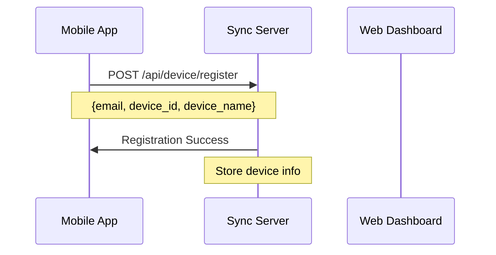
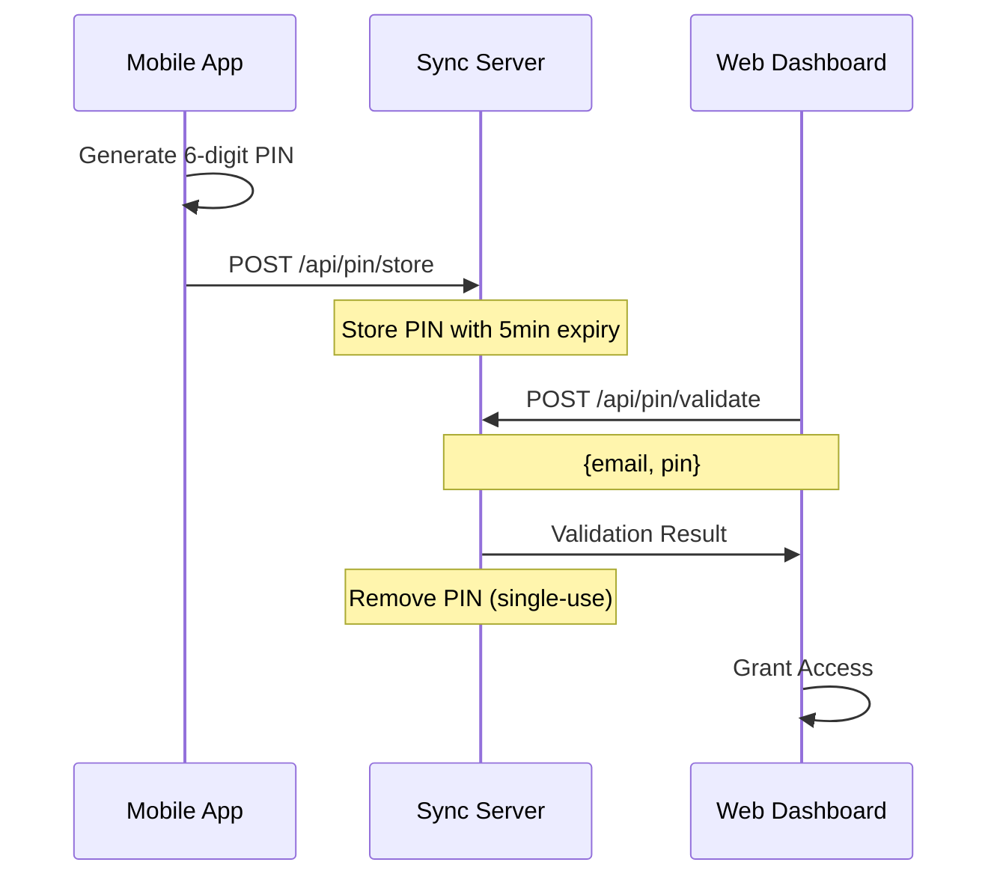
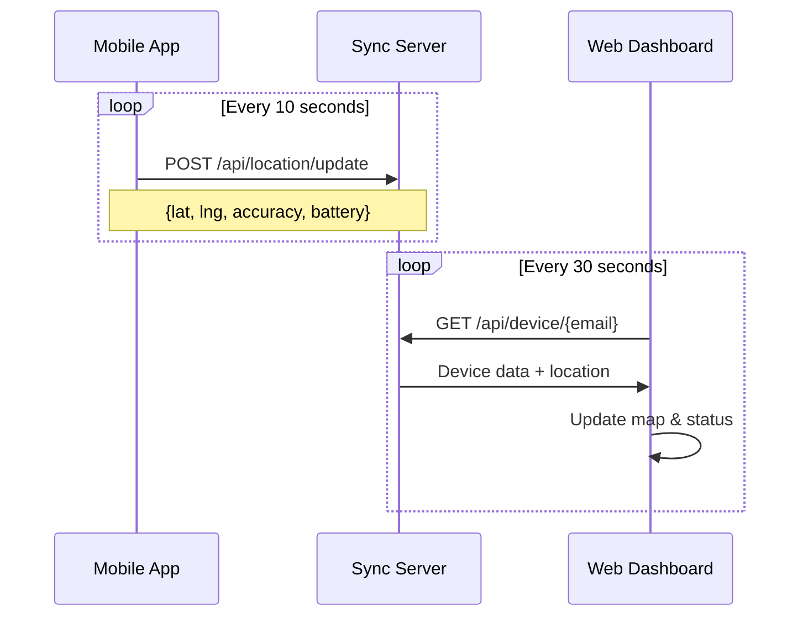
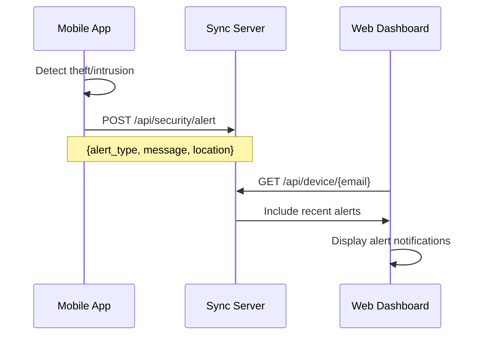

# 🛡️ Secure Guardian - Complete Sync System

## 🔄 Real-Time Synchronization Between Mobile App & Web Dashboard

### 🌟 System Overview

This system provides **complete real-time synchronization** between the Android mobile app and web dashboard, enabling:

- **🔑 PIN-based Authentication** - Generate PINs on mobile, validate on web
- **📍 Live Location Tracking** - Real-time GPS sync from mobile to web
- **🔋 Battery Monitoring** - Live battery status display on web dashboard
- **🚨 Security Alerts** - Instant theft/intrusion alerts across platforms
- **📱 Device Status** - Complete device information sync

---

## 🏗️ Architecture

### 📱 Mobile App (Android)
```
app/src/main/java/com/antitheft/pro/
├── api/ApiService.java                 # Server communication
├── activities/
│   ├── MainActivity.java               # Main dashboard
│   ├── PinGeneratorActivity.java       # PIN generation & sync
│   ├── DeviceRegistrationActivity.java # Device registration
│   ├── TrackingActivity.java           # Location display
│   └── SettingsActivity.java           # Configuration
├── services/
│   └── LocationTrackingService.java    # Background location sync
└── utils/
    ├── SecurityManager.java            # Security features
    └── PermissionManager.java          # Permission handling
```

### 🌐 Web Dashboard
```
public/
├── app-pin-login.html                  # PIN authentication page
├── advanced-tracking.html              # Real-time tracking dashboard
└── assets/                             # Static resources
```

### 🖥️ Sync Server
```
sync-server.js                          # Main synchronization server
├── /api/device/register               # Device registration
├── /api/device/sync                   # Status synchronization
├── /api/pin/validate                  # PIN validation
├── /api/pin/store                     # PIN storage
├── /api/location/update               # Location updates
└── /api/security/alert                # Security alerts
```

---

## 🔄 Synchronization Flow

### 1. 📱 Device Registration


### 2. 🔑 PIN Authentication


### 3. 📍 Location Sync


### 4. 🚨 Security Alerts


---

## 🚀 Setup Instructions

### 1. 📱 Mobile App Setup

#### Prerequisites
- **Android Studio** 4.0+
- **Android SDK** API 21+
- **Java 8**+

#### Build Steps
```bash
# Clone repository
git clone https://github.com/hlias123/antitheft-pro.git
cd antitheft-pro

# Open in Android Studio
# Sync Gradle files
# Build and run on device/emulator
```

#### Key Configuration
```java
// app/src/main/java/com/antitheft/pro/api/ApiService.java
private String serverUrl = "http://your-server.com:8080";
```

### 2. 🖥️ Server Setup

#### Install Dependencies
```bash
# Copy server package.json
cp server-package.json package.json

# Install dependencies
npm install express cors body-parser helmet compression morgan
```

#### Start Server
```bash
# Development
node sync-server.js

# Production
npm start
```

#### Server Configuration
```javascript
const PORT = process.env.PORT || 8080;
// Server runs on http://localhost:8080
```

### 3. 🌐 Web Dashboard

The web dashboard is served automatically by the sync server:
- **Login Page**: `http://localhost:8080/`
- **Tracking Dashboard**: `http://localhost:8080/advanced-tracking.html`

---

## 🔧 API Endpoints

### 📱 Device Management

#### Register Device
```http
POST /api/device/register
Content-Type: application/json

{
  "device_id": "android_ABC123_1699123456789",
  "email": "user@example.com",
  "device_name": "My Phone",
  "android_version": "13",
  "app_version": "1.0.0"
}
```

#### Sync Device Status
```http
POST /api/device/sync
Content-Type: application/json

{
  "device_id": "android_ABC123_1699123456789",
  "battery_level": 85.5,
  "battery_status": "good",
  "location": {
    "latitude": 37.7749,
    "longitude": -122.4194,
    "accuracy": 5.0,
    "timestamp": 1699123456789
  },
  "security_status": "full_protection",
  "tracking_active": true,
  "intruder_detection": true,
  "emergency_mode": false
}
```

### 🔑 PIN Management

#### Store PIN
```http
POST /api/pin/store
Content-Type: application/json

{
  "email": "user@example.com",
  "pin": "123456",
  "device_id": "android_ABC123_1699123456789",
  "expiry": 1699123756789
}
```

#### Validate PIN
```http
POST /api/pin/validate
Content-Type: application/json

{
  "email": "user@example.com",
  "pin": "123456",
  "device_id": "android_ABC123_1699123456789"
}
```

### 📍 Location Tracking

#### Update Location
```http
POST /api/location/update
Content-Type: application/json

{
  "device_id": "android_ABC123_1699123456789",
  "latitude": 37.7749,
  "longitude": -122.4194,
  "accuracy": 5.0,
  "battery_level": 85.5,
  "timestamp": 1699123456789
}
```

### 🚨 Security Alerts

#### Send Alert
```http
POST /api/security/alert
Content-Type: application/json

{
  "device_id": "android_ABC123_1699123456789",
  "alert_type": "theft_detected",
  "message": "Device moved 150 meters without authorization",
  "latitude": 37.7749,
  "longitude": -122.4194,
  "timestamp": 1699123456789
}
```

---

## 📊 Data Flow Examples

### 🔋 Battery Sync
```javascript
// Mobile App (Java)
float batteryLevel = getBatteryLevel(); // 85.5%
apiService.syncDeviceStatus(); // Sends to server

// Web Dashboard (JavaScript)
fetch('/api/device/user@example.com')
  .then(response => response.json())
  .then(data => {
    document.getElementById('batteryLevel').textContent = 
      Math.round(data.device.battery_level) + '%';
  });
```

### 📍 Location Sync
```javascript
// Mobile App (Java)
@Override
public void onLocationChanged(Location location) {
    apiService.sendLocationUpdate(
        location.getLatitude(),
        location.getLongitude(),
        location.getAccuracy()
    );
}

// Web Dashboard (JavaScript)
function updateMapWithRealLocation(location) {
    map.setView([location.latitude, location.longitude], 18);
    deviceMarker.setLatLng([location.latitude, location.longitude]);
}
```

### 🔑 PIN Validation
```javascript
// Mobile App (Java)
String pin = generateSecurePin(); // "123456"
sendPinToServer(pin, expiryTime);

// Web Dashboard (JavaScript)
const response = await fetch('/api/pin/validate', {
    method: 'POST',
    headers: { 'Content-Type': 'application/json' },
    body: JSON.stringify({ email, pin })
});
const result = await response.json();
if (result.valid) {
    window.location.href = 'advanced-tracking.html';
}
```

---

## 🔒 Security Features

### 🛡️ PIN Security
- **SecureRandom Generation** - Cryptographically secure PINs
- **5-Minute Expiration** - Time-based security
- **Single-Use Tokens** - Prevents replay attacks
- **Server-Side Validation** - Centralized security

### 📱 Device Security
- **Unique Device IDs** - Hardware-based identification
- **Encrypted Communication** - HTTPS/TLS encryption
- **Permission Validation** - Runtime permission checks
- **Background Protection** - Continuous monitoring

### 🌐 Web Security
- **CORS Protection** - Cross-origin request security
- **Input Validation** - Server-side validation
- **Session Management** - Secure session handling
- **Rate Limiting** - API abuse prevention

---

## 🚀 Deployment

### 📱 Mobile App Deployment

#### Debug Build
```bash
./gradlew assembleDebug
# APK: app/build/outputs/apk/debug/app-debug.apk
```

#### Release Build
```bash
./gradlew assembleRelease
# APK: app/build/outputs/apk/release/app-release.apk
```

### 🖥️ Server Deployment

#### Local Development
```bash
node sync-server.js
# Server: http://localhost:8080
```

#### Production (Railway/Heroku)
```bash
# Set environment variables
export PORT=8080
export NODE_ENV=production

# Start server
npm start
```

#### Docker Deployment
```dockerfile
FROM node:18-alpine
WORKDIR /app
COPY package*.json ./
RUN npm install --production
COPY . .
EXPOSE 8080
CMD ["npm", "start"]
```

---

## 📈 Monitoring & Analytics

### 📊 Server Metrics
```http
GET /api/status
```
```json
{
  "status": "online",
  "timestamp": 1699123456789,
  "devices_count": 15,
  "active_pins": 3,
  "total_alerts": 42,
  "uptime": 86400
}
```

### 📱 Device Metrics
- **Battery Level** - Real-time monitoring
- **Location Accuracy** - GPS precision tracking
- **Connection Status** - Online/offline detection
- **Security Events** - Alert frequency analysis

### 🌐 Web Analytics
- **PIN Usage** - Authentication frequency
- **Dashboard Access** - User engagement
- **Feature Usage** - Most used functions
- **Response Times** - Performance monitoring

---

## 🔧 Troubleshooting

### 📱 Mobile App Issues

#### Connection Problems
```java
// Check server URL in settings
String serverUrl = prefs.getString("server_url", "http://localhost:8080");
// Update if needed: Settings > Server Configuration
```

#### Permission Issues
```java
// Check required permissions
if (!permissionManager.isLocationPermissionGranted()) {
    // Request location permission
    ActivityCompat.requestPermissions(this, permissions, REQUEST_CODE);
}
```

### 🖥️ Server Issues

#### Port Conflicts
```bash
# Check if port is in use
netstat -an | grep :8080

# Use different port
PORT=3000 node sync-server.js
```

#### Memory Issues
```bash
# Monitor memory usage
node --max-old-space-size=4096 sync-server.js
```

### 🌐 Web Dashboard Issues

#### API Connection
```javascript
// Check server status
fetch('/api/status')
  .then(response => response.json())
  .then(data => console.log('Server status:', data))
  .catch(error => console.error('Connection error:', error));
```

#### PIN Validation
```javascript
// Debug PIN validation
console.log('Validating PIN:', { email, pin });
// Check server logs for validation attempts
```

---

## 🎯 Performance Optimization

### 📱 Mobile App
- **Background Services** - Optimized location updates
- **Battery Efficiency** - Smart sync intervals
- **Memory Management** - Proper lifecycle handling
- **Network Optimization** - Compressed data transfer

### 🖥️ Server
- **In-Memory Storage** - Fast data access
- **Connection Pooling** - Efficient resource usage
- **Compression** - Reduced bandwidth usage
- **Caching** - Improved response times

### 🌐 Web Dashboard
- **Lazy Loading** - On-demand resource loading
- **Real-Time Updates** - WebSocket connections
- **Responsive Design** - Mobile-optimized interface
- **Progressive Enhancement** - Graceful degradation

---

## 🔮 Future Enhancements

### 📱 Mobile Features
- **Biometric Authentication** - Fingerprint/face unlock
- **Offline Mode** - Local data storage
- **Multi-Device Support** - Cross-device sync
- **Advanced Analytics** - ML-based threat detection

### 🌐 Web Features
- **Real-Time Notifications** - WebSocket alerts
- **Historical Analytics** - Long-term data analysis
- **Multi-User Support** - Family/team accounts
- **Advanced Mapping** - Satellite imagery, traffic

### 🖥️ Server Features
- **Database Integration** - Persistent storage
- **Microservices** - Scalable architecture
- **Load Balancing** - High availability
- **API Rate Limiting** - Enhanced security

---

## 📞 Support & Documentation

### 🔗 Links
- **GitHub Repository**: https://github.com/hlias123/antitheft-pro
- **API Documentation**: `/api/docs` (when server is running)
- **Mobile App Guide**: `MOBILE_APP_README.md`
- **Web Dashboard Guide**: `WEB_DASHBOARD_README.md`

### 🆘 Getting Help
- **Issues**: [GitHub Issues](https://github.com/hlias123/antitheft-pro/issues)
- **Discussions**: [GitHub Discussions](https://github.com/hlias123/antitheft-pro/discussions)
- **Wiki**: [Project Wiki](https://github.com/hlias123/antitheft-pro/wiki)

---

**🛡️ Secure Guardian - Complete synchronization between mobile and web for ultimate device protection**